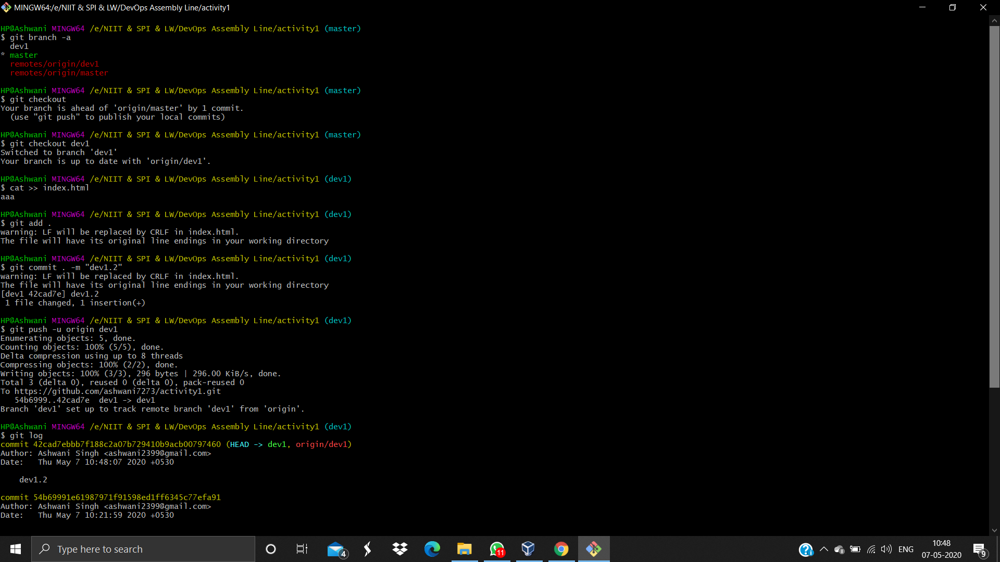

# activity1

**Steps to Automation or Continous Integration**

**Step 1:** Create a new repo in github(e.g. activity1) &amp; initialize it with a local git repo.

**Step 2:** Create a file( e.g. index.html ) in local git by appending data from 2 different branches (i.e. master &amp; dev1).And then we upload the data to the github by using commands given below:

1. git add .
2. git commit . -m &quot;Comment&quot;
3. git push -u origin &quot;branch\_name&quot;

**Step 3:** Now we create 3 jobs in our continuous integration tool i.e. Jenkins

**JOB 1 :** The duty of this job is to track the data of branch dev1 from the github.

Further more deploy the data to testing environment by launching an OS with the docker image of httpd.

.png)

**JOB 2 :** The duty of this job is to fetch the data of the master branch from github.

And then we deploy the data to web server in the production environment consisting of an docker image httpd OS &amp; web server.

.png)

**Note : Make sure both the environment i.e. testing &amp; production should be identical.**

**JOB 3 :** The duty of this job is to fetch the data from testing environment &amp; provide the certificate for the changes which is done by dev1 branch &amp; that certificate is provided by the Quality Assurance Team

Behind the scene,this job will merge the data of dev1 branch with the master branch.

.png)

And finally we push that merged data to github (internally) which triggers the activity1.2 automatically when this job is built. Hence the data gets deployed to the production environment. In the end we check the output manually of the jobs.

.png)

**Note : Job Chaining must exist between the jobs .**

**STEP 4:** Expose the data through PAT

In this step we perform the PAT concept to expose the docker OS data to our base OS or third party OS i.e. (Windows , Mac etc.) by the help of command

-pnew\_port:80

Here 80 is the default port no of Apache Web Server that we are using in this operation.

**STEP 5:** Implementation of Tunnelling Concepts

In this step we perform tunnelling operation by ngrok for using our application from client side.

Ngrok is the software which converts the private IP to public IP.

